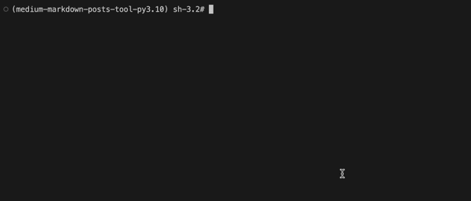

# Medium Markdown Posts Tool

Creating Medium posts directly in the Medium editor can be cumbersome, especially for those who prefer using markdown. This tool aims to simplify the process and provide a more efficient way to compose and manage your Medium articles.

## Introduction

Welcome to the Medium Markdown Posts Tool! This tool is designed to simplify the process of creating [Medium](https://medium.com) posts by leveraging the [Medium API](https://github.com/Medium/medium-api-docs) and allowing you to use familiar markdown syntax. Say goodbye to the hassle of navigating the Medium editor UI with this streamlined command line tool.

## Features

- Command Line Interface: Create your `Medium` posts using simple command line interactions.
- Markdown Support: Write your posts using markdown, making it easy to structure and format your content.
- Effortless Publishing: Seamlessly publish your articles directly from the command line.

## Requirements

- `Configure Medium API Key:`
Obtain your `Medium API key` from the Medium > Settings > [Security and apps](https://medium.com/me/settings/security) > Integration tokens.

## Installation

> Poetry
```console
$ poetry add git+https://github.com/liuliuOD/Medium-Markdown-Posts-Tool.git
```

> pip
```console
$ pip install git+https://github.com/liuliuOD/Medium-Markdown-Posts-Tool.git
```

## Usage

- Export Medium token
```console
$ export TOKEN="replace to your Medium token"
```

- Creating a New Post

> CLI mode
```console
# out of the virtual environment
$ poetry run medium post:create --title your_custom_title --file your_filepath -H -P -N -O -t post_tag_1 -t post_tag_2

# in the virtual environment
$ medium post:create --title your_custom_title --file your_filepath -H -P -N -O -t post_tag_1 -t post_tag_2
```

> Interaction mode
```console
# out of the virtual environment
$ poetry run medium post:interact

# in the virtual environment
$ medium post:interact
```

- Get more informations
```console
# out of the virtual environment
$ poetry run medium --help

# in the virtual environment
$ medium --help
```

## Demo

- CLI demo



- After create


*the stories page of the `Medium`*


*use `default content format` with file format `markdown`*


*use option `-H` though the file format is `markdown`*

## Contribution

Contributions are welcome! If you have ideas for improvements or want to fix a bug, feel free to open an issue or submit a pull request.

## License

This project is released under the AGPL v3 license. See the [LICENSE](./LICENSE) file for more details.

## References

- [Medium API Documentation](https://github.com/Medium/medium-api-docs)
- [How to generate a mock User-Agent](https://stackoverflow.com/questions/48454949/how-do-i-create-a-random-user-agent-in-python-selenium)
